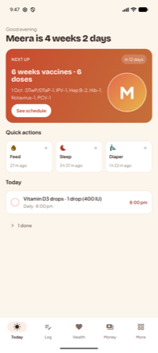
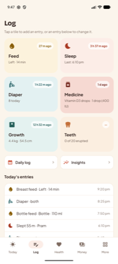
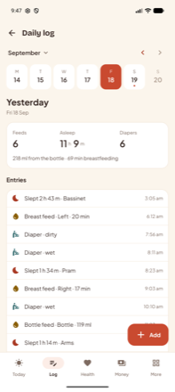
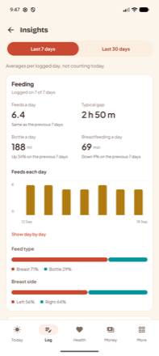
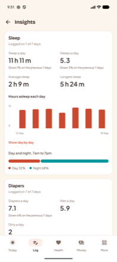
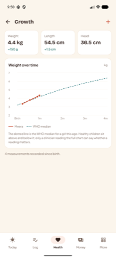
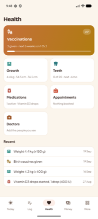
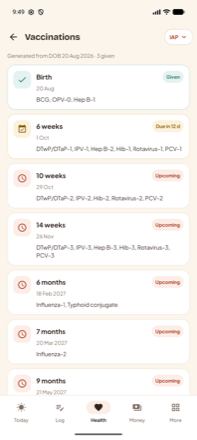
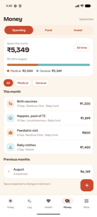

# Kilkari

An offline-first Android baby tracker. Everything lives on the phone — no account, no server.
Built in Kotlin with Jetpack Compose and Room, from the Claude Design canvas in
[`design/Kilkari Baby Tracker.dc.html`](design/Kilkari%20Baby%20Tracker.dc.html).

## What it looks like

Screens from a debug build with sample data — a four-week-old with a month of feeds, sleeps and
diapers behind her.

| Today | Log | Daily log |
| --- | --- | --- |
|  |  |  |
| The next thing due, the three most-used actions with when they last happened, and everything outstanding today. | Six tiles to log from, then the day's entries — tap one to correct it. | Any earlier day: its totals, its entries, and a way to file something that was missed. |

| Insights · feeding | Insights · sleep | Growth |
| --- | --- | --- |
|  |  |  |
| Averages over 7 or 30 days, per logged day, with what changed against the period before. | Sleep split at midnight between the days it touches, and day against night. | Weigh-ins against the WHO median for a child of that age and sex. |

| Health | Vaccinations | Money |
| --- | --- | --- |
|  |  |  |
| One way into each health area, over what was recorded recently. | Generated from the date of birth against the chosen schedule. | What went out this month, split medical against general, with earlier months folded away. |

## What's in it

**Five tabs** — Today · Log · Health · Money · More, plus eighteen pushed screens.

| Area | Screens |
| --- | --- |
| Launch | System splash hands over to a branded Compose splash that covers the database read |
| Onboarding | A short wizard: welcome → baby → measurements → schedule → currency → **catch-up** → summary |
| Today | Three interchangeable layouts: **Agenda** (default), **Hero**, **Checklist**, all rendering the same due-today list. Switch in Settings. |
| Log | Six quick-log tiles (feed, sleep, diaper, medicine, growth, teeth) over the day's entries, plus **Daily log** (any earlier day) and **Insights** (7- and 30-day averages) |
| Health | Hub → Vaccines, Vaccine group detail, Growth (WHO percentile bands and the reading's own percentile), Teeth, Medications, Appointments, Doctors |
| Money | Three views: **Spending** (monthly split, ledger), **Fund** (the savings account everything is paid from), **Invest** (FD, RD, SIP, PPF, Sukanya Samriddhi, gold) |
| More | Timeline, Documents, Document detail, **Paperwork**, Photo albums, Birthdays & events, Reminders, Backup & export, Settings |

**Catch-up runs whenever you need it** — at onboarding, and again from Settings afterwards, for
anyone who set the app up in a hurry or switched schedule later. Only what is genuinely
outstanding is offered: a vaccine group with any dose already recorded is left alone rather than
overwritten, and a milestone already on the timeline is not offered twice.

**Starting late is the normal case.** Once onboarding knows the date of birth and the schedule,
it works out which vaccine groups and which typical milestones are already behind you, and offers
to record them — each with an editable date, defaulted to when it was due. A newborn sees only the
birth doses; a seven-month-old sees five vaccine groups and seven milestones. Both steps are
skippable, and the whole thing is written in one transaction at the end.

**Nothing is stuck on today.** Every action carries its own date — a feed, a nap, a diaper, a
dose of medicine, a measurement, a tooth, a vaccine, an expense, a fund deposit or withdrawal,
an investment contribution or restated value, a moment, a filed scan. Each one defaults to now,
which is still the common case, and each one can be moved back, so what you enter at bedtime is
filed against the afternoon it happened. Times go back too, not just days. Dates read back as
"Today, 20 Aug" or "Yesterday, 19 Aug", and a back-dated entry says which day it landed on when
it saves. Nothing can be dated into the future except an appointment or an event, which are
meant to be. A whole nap can be entered after the fact rather than started and ended live, and a
tooth is recorded through a sheet that asks when it came through — teeth are usually noticed
days late, so the chart was otherwise a record of when someone looked. A back-dated entry does
not tick off a reminder whose occurrence it predates: last week's weigh-in does not clear this
week's prompt.

**Everything saved can be reopened.** Journal and money entries, the child's details, custom
reminders, recorded teeth, appointments, filed documents, photo albums, birthdays and events,
and recorded vaccine doses all open in the sheet that created them. A recorded dose keeps its
cost out of that sheet: the cost went to Money as its own expense, editable there, and a second
copy of it could only disagree.

**Nothing is written in stone either.** Every journal entry and every money entry can be
reopened from the list it appears in — a feed, a nap, a diaper, a dose, a measurement, an
expense, a fund deposit or withdrawal, an investment contribution, a moment on the timeline —
and corrected or removed in the same sheet that recorded it. The Log tab's **Daily log** opens
any earlier day — its totals and its entries — so a back-dated entry does not become
uncorrectable once the day rolls over, and something missed can still be filed against the day
it belongs to. On the Money tab a fund ledger line opens whatever
produced it, whether that was a deposit, an expense or an instalment, and a holding lists its
contributions so a mistyped one is fixed rather than papered over with a restated value.
Because balances and totals are derived rather than mirrored, a corrected amount moves the fund
balance and the invested total with it.

**Vaccination schedules** are generated from the baby's date of birth against one of four
published schedules — IAP (India private), UIP (India government), WHO, or CDC. Changing the
schedule regenerates due dates; doses already recorded stay marked.

**One due-today list.** Everything outstanding — medicine doses, today's appointments, overdue
vaccine groups, the next identity document, the fund top-up, weekly prompts and anything you
added yourself — is derived in
one place and rendered identically by all three Today layouts, so they cannot drift apart. Each
thing appears exactly once, from whichever source actually owns it. Daily items clear themselves
overnight; anything less frequent (the Sunday photo check-in, a monthly reminder) stays put
until it is ticked off or dismissed, rather than vanishing when the day rolls over.

**Doctors** are kept in one directory. Appointments, vaccination records and prescriptions pick
from it through a secondary bottom sheet, with "Add a doctor" opening a third — so a new name can
be saved without abandoning the form, and choosing someone fills in their clinic too. Where a
phone number is saved, the row offers a call (which opens the dialler pre-filled rather than
placing the call) and a WhatsApp message. Records store the doctor's *name*, not a reference, so
renaming someone later does not rewrite past appointments.

**Paperwork** is the chain of identity documents a newborn needs, in the order the offices
themselves insist on: birth certificate, then Aadhaar, then passport, then PAN. Only one is ever
"next". The birth certificate is due 45 days from birth; each of the others a set number of days
after the one before it was obtained (30, 60 and 30). The one whose turn it is appears on Today a
week before it is due, notifies a week before, the day before, on the day and then weekly while
it waits, and stays put until it is recorded — there is nothing to dismiss, because an office
visit that slips is still owed. Every step opens to what to carry, the suggested date (which can
be replaced with your own), and a way to set it aside so the chain moves on without pretending.
Filing a scan titled "Birth certificate" or "Aadhaar card" under Documents records that document
as obtained, the same way a weigh-in clears the weigh-in prompt, and obtaining one writes a
Timeline entry.

**Reminders** are yours to define. The seven built-in ones are switches over data the app already
has; beyond those you can add your own with a time, an optional cadence (once, daily, weekly on a
chosen day, monthly on a chosen date), and a note. They feed both the notification worker and the
Today list.

**Recording a dose** works the same whether you tap one vaccine's *Mark given* or *Mark all
given*: both open the same sheet — date, clinic, doctor, an optional **brand** per vaccine, and
a cost. Recording a dose writes a Timeline entry and, if you enter a cost, posts a Medical
expense to Money. Marking part of a group and returning later accumulates the group's cost
rather than replacing it.

**The fund** is the savings account the child's costs come out of. You set a standing monthly
top-up (amount, day, account name) and Kilkari nudges you when it is due. The balance is
**derived, never mirrored**: deposits, less manual withdrawals, less expenses marked *paid from
fund*, less investment contributions funded from it. Deleting an expense or a holding restores
the balance on its own — there are no duplicate rows to keep in sync.

**The fund can hold more than one account** — a bank account, a gift envelope, a cash tin —
each with its own balance, and money moves between them as a matched withdrawal and deposit, so
neither balance is anything but the sum of what went through it. Every expense and contribution
paid from the fund says which account paid. A family with one account never meets the idea: the
first account is created the moment money is first recorded, and the extra controls only appear
once a second one exists.

**Checking against a statement** ticks off deposits and withdrawals up to a statement date,
compares the ticked total against the closing balance, and shows the difference until it is
nothing. Ticked lines are stamped with that date, so the next check starts where the last one
finished. Each side of a transfer is ticked on its own account's statement.

**Investments** cover the instruments a parent actually opens for a child: fixed and recurring
deposits, mutual fund SIPs, PPF, Sukanya Samriddhi, gold, or anything else. Each holding tracks
what has been put in (its contribution ledger), what it is worth now (you restate the value when
it moves), and — for fixed instruments — what the bank says it will be worth at maturity. The app
does not project returns or invent numbers; it records what you tell it.

**What a holding has earned** is an annualised return (XIRR) over the dates money actually went
in, so a plan paid monthly can be read against a lump sum, and it is withheld below a month of
holding, where it would be arithmetic noise. Fixed instruments also show what the rate entered
comes to at maturity, compounded quarterly as Indian deposits are quoted, alongside — never
instead of — the bank's own figure. The arithmetic is checked in `ReturnsTest`.

**Currency** is a setting (₹ default, plus $ / € / £). Amounts are stored in whole rupees and
converted for display, so switching currency reformats every screen at once. **Units** work the
same way: weights and lengths are stored in kilograms and centimetres — what the WHO tables
speak — and drawn in pounds and inches when the setting says so, including the growth chart's
axis and the forms, which then ask for pounds and ounces separately rather than a decimal.

**The growth chart** draws the WHO percentile bands for the child's age and sex — the middle 70%
and 94% of children — and says which percentile the last weigh-in sits on. The reference values
are the WHO 2006 weight-for-age LMS parameters, and the percentile maths is checked against
WHO's own published percentile tables in `GrowthStandardsTest`.

## Running it

Requires JDK 17 and the Android SDK (compileSdk 35, minSdk 26).

```bash
./gradlew :app:installDebug
```

Or open the project in Android Studio and hit Run. `local.properties` is generated locally and
is not committed — Android Studio writes it for you, or:

```bash
echo "sdk.dir=$HOME/Library/Android/sdk" > local.properties
```

Build every shippable artifact in one command:

```bash
./tools/build-artifacts.sh
```

That runs `bundleRelease`, `assembleRelease` and `assembleDebug`, then collects the results in
`release/` under version-stamped names, verifies each APK actually opens and reports whether it
is signed, and writes a `release/BUILD-INFO.md` recording the commit, sizes and SHA-256s. Run it
with `--help` for the options (`--clean`, `--debug-only`, `--release-only`, `--out DIR`).

You get the **.aab** Google Play requires for new apps, a universal **.apk** for sideloading, the
**debug APK** (installs alongside the release as `com.kilkari.debug`), and the R8 **mapping.txt**
you need to read Play crash reports for a minified build.

The release artifacts are unsigned unless you add a `keystore.properties` at the repo root — the
script picks it up automatically and drops `-unsigned` from the filenames. Copy
`keystore.properties.example` and create the key:

```bash
keytool -genkeypair -v -keystore kilkari-upload.jks -alias kilkari -keyalg RSA -keysize 2048 -validity 10000
```

The keystore and `keystore.properties` are gitignored. **Back the keystore up somewhere safe** —
losing it means never being able to publish an update to the same listing.

Without a keystore the script also emits a copy of the release APK signed with the SDK's public
debug key, so the minified build can still be installed and smoke-tested. It is marked
`DEBUGSIGNED-testing-only` and must never be published.

## Layout

```
app/src/main/java/com/kilkari/
├── data/
│   ├── db/         Room entities, DAOs, database, type converters
│   ├── prefs/      DataStore settings (currency, schedule, units, Today variant)
│   ├── repo/       KilkariRepository — the single data entry point; BackupManager
│   └── seed/       The four vaccination schedules
├── domain/         Models, enums, and all date/money/age formatting
├── ui/
│   ├── theme/      Colour tokens, type scale, theme
│   ├── components/ Shared kit — cards, chips, sheets, nav bar, icon mapping
│   ├── nav/        Routes and NavHost
│   ├── screens/    One file per screen
│   └── sheets/     Bottom-sheet contents, grouped by area
└── work/           Daily reminder worker
```

### A few decisions worth knowing

- **App icon.** Built from `design/icon-source.jpg` by `tools/make_icons.py` (needs Pillow).
  The artwork is a finished square badge, so the adaptive foreground carries it at 85% of the
  108dp canvas — measured against the Pixel launcher's mask with a ringed calibration icon, since
  the documented 66dp "safe zone" is far smaller than what launchers actually reveal. Below that
  it left a visible ring; above it, the gold sound waves clipped. The themed-icon layer is a
  hand-drawn vector silhouette, as a photographic layer cannot be tinted.

- **One ViewModel.** Kilkari is a single-baby surface with heavy cross-screen coupling, so
  `KilkariViewModel` holds shared state rather than splitting per screen.
- **Icons.** The design names Material Symbols Rounded glyphs. `KIcons` maps those names onto
  Compose's icon set so screen code keeps the design's vocabulary; `dentistry` has no Compose
  equivalent and is drawn locally as `KIcons.Tooth`.
- **Fonts.** Bricolage Grotesque (display) and Plus Jakarta Sans (UI) load through the Google
  Fonts downloadable-font provider, with a platform sans fallback.
- **Light only.** The design has one ground colour and its tinted accent cards read incorrectly
  inverted, so the app does not follow the system dark theme.
- **Money precision.** Amounts are stored as whole INR (`amountInr`) and converted at display
  time. Rates are fixed constants, matching the prototype — there is no FX lookup.

## Tests

```bash
./gradlew :app:testDebugUnitTest
```

77 JUnit cases, all on the JVM — Robolectric supplies SQLite for the ones that need a real
database, so there is nothing to plug in.

| Area | What it covers |
| --- | --- |
| `MigrationTest` | Builds a database in an older shape from that version's exported schema, fills it, and opens it through Room — which runs the migrations and refuses to open if the result does not match the entities. Includes a full version 1 → 12 run. |
| `RepositoryTest` | The writes that touch more than one table: transfers, deleting an account that is still in use, reconciling one half of a transfer, and a corrected date of birth moving the arrival entry, the birthday and the growth chart's first point. |
| `FundMathTest` | Balances, per-account balances, the ledger, and when the monthly top-up is due. |
| `RecurrenceTest` | Which days a reminder falls on, and which minute the notification chain arms next — including not re-arming the minute that just fired. |
| `InsightsTest` | The daily averages: logged days rather than calendar days, sleep split at midnight, medians, adherence. |
| `GrowthStandardsTest` | The WHO percentile curves, against WHO's own published percentile tables. |
| `ReturnsTest` | XIRR and the maturity projection. |
| `UnitsTest`, `PaperworkTest` | Unit conversion round-trips; the identity-document chain. |

## Data, backup and privacy

Nothing leaves the device unless you export it.

- **Backup** writes a `.kilkari` zip (SQLite database, scanned pages, the child's photo and the
  settings store — currency, schedule, units, Today layout and the fund top-up) through the
  Storage Access Framework, so you choose where it lands. Backups are **not encrypted**.
- **Restore** replaces the current database and scans, and needs an app restart to take effect.
- **CSV export** writes logs, growth, vaccines, expenses, timeline, events, fund movements,
  investments and contributions as one file.
- **Vaccination record PDF** is a one-page A4 immunisation record for a school or clinic.
- **Documents** are camera captures stored in app-private storage (`files/documents`), shared
  only through Android's share sheet.
- **Photo albums** are Google Photos links; the app never stores the photos.

## Not done yet

- Multi-baby support — the schema has a `babyId` throughout but the UI assumes one baby.
- Investment values are whatever you last entered. The app is offline by design, so there is no
  price feed: a holding's return is only as current as the value last written down, and the
  screen says so.
- No UI tests. The 77 JUnit cases in `app/src/test` cover the arithmetic, the database and its
  migrations (through Robolectric), but nothing drives the Compose screens.
